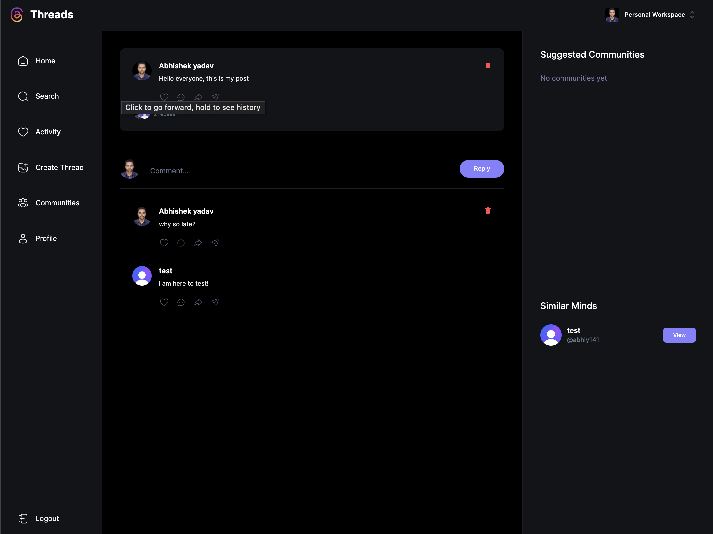

# Thread-Clone Application

This is a web application that replicates the functionality of an online thread-based platform, allowing users to create, view, and interact with threads. The application is built using React, Next.js, Tailwind CSS, Cleark for authentication, and MongoDB for data storage.

![Thread-Clone Screenshot]

## Features

- User Authentication: Utilizes Cleark for user authentication, ensuring secure access to the application.
- Thread Creation: Users can create new threads, providing a title, content, and category.
- Thread Viewing: Users can browse existing threads by category and view thread details.
- Thread Interaction: Users can comment on threads and upvote/downvote both threads and comments.

## Technologies Used

- React: A JavaScript library for building user interfaces.
- Next.js: A framework for server-rendered React applications.
- Tailwind CSS: A utility-first CSS framework for quickly styling the application.
- Cleark: A service for adding authentication to applications.
- MongoDB: A NoSQL database for storing thread and user data.

## Prerequisites

Before you begin, ensure you have the following installed:

- Node.js: Make sure you have Node.js installed on your machine.
- MongoDB: Set up a MongoDB database and obtain the connection URI.

## Installation

1. Clone the repository: `git clone https://github.com/your-username/thread-clone.git`
2. Navigate to the project directory: `cd thread-clone`
3. Install dependencies: `npm install`

## Running the Application

1. Start the development server: `npm run dev`
2. Open your browser and navigate to `http://localhost:3000`

## Deployment

To deploy the application to a production environment, follow the deployment guidelines for Next.js applications. This might involve setting up server configurations, deploying to hosting platforms, and configuring environment variables.

## Contributing

Contributions are welcome! If you'd like to contribute to this project, please follow these steps:

1. Fork the repository.
2. Create a new branch: `git checkout -b feature/your-feature-name`
3. Make your changes and commit them: `git commit -am 'Add some feature'`
4. Push to the branch: `git push origin feature/your-feature-name`
5. Submit a pull request detailing your changes.

## License

This project is licensed under the [MIT License](LICENSE).

---

Feel free to modify this README template to suit your application's specific details and requirements. Good luck with your Thread-Clone application! If you have any questions, feel free to reach out.
# threads
# Threads-Clone
